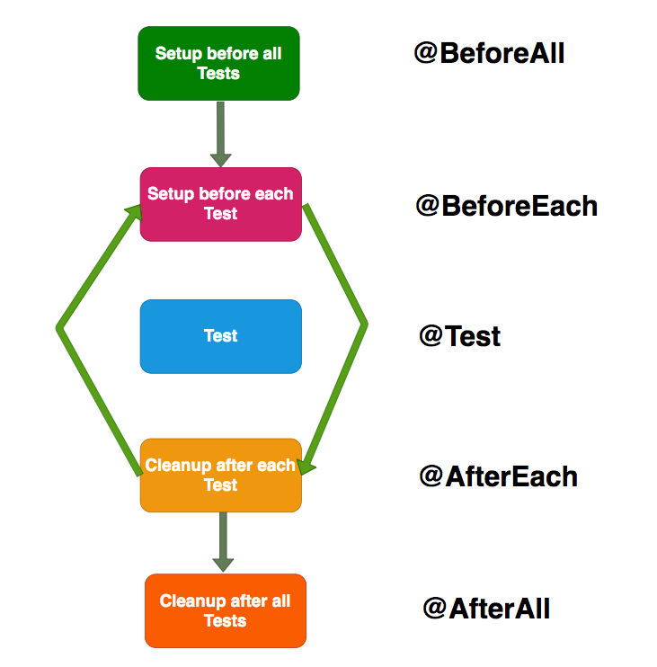
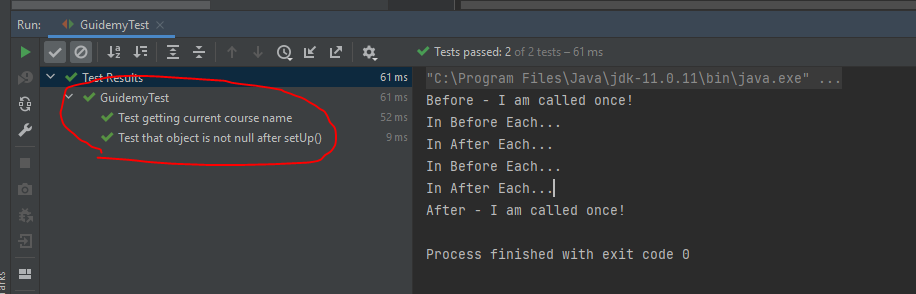
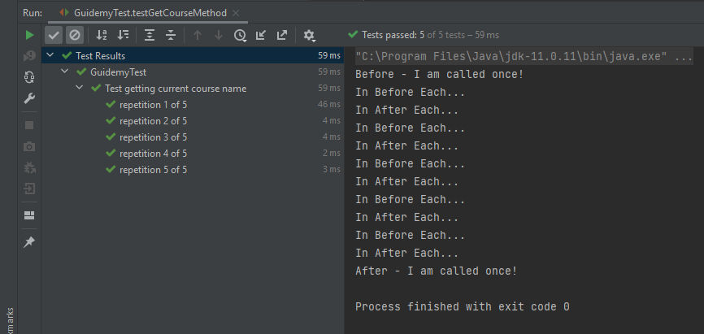
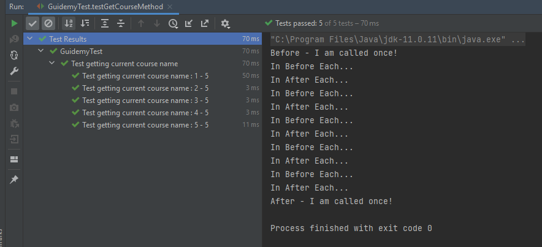
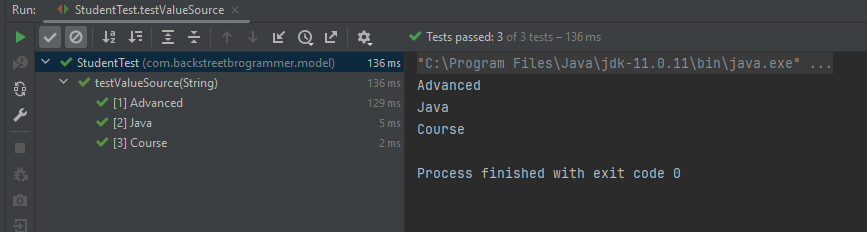

# Test Driven Development (TDD)

> This is a tutorials course covering Test-Driven-Development (TDD) in Java.

Tools used:

- JDK 11
- Maven
- JUnit 5, Mockito
- IntelliJ IDE

## Table of contents

1. [Introduction to Test-Driven-Development (TDD)](https://github.com/backstreetbrogrammer/37_TestDrivenDevelopment#chapter-01-introduction-to-test-driven-development-tdd)
    - [Testing Terminology](https://github.com/backstreetbrogrammer/37_TestDrivenDevelopment#testing-terminology)
    - [JUnit Test Example](https://github.com/backstreetbrogrammer/37_TestDrivenDevelopment#junit-test-example)
    - [Common Java Testing Frameworks](https://github.com/backstreetbrogrammer/37_TestDrivenDevelopment#common-java-testing-frameworks)
    - [Continuous Integration and Continuous Delivery (CI/CD)](https://github.com/backstreetbrogrammer/37_TestDrivenDevelopment#continuous-integration-and-continuous-delivery-cicd)
2. [JUnit in details](https://github.com/backstreetbrogrammer/37_TestDrivenDevelopment#chapter-02-junit-in-details)
    - [JUnit 5 Modules](https://github.com/backstreetbrogrammer/37_TestDrivenDevelopment#junit-5-modules)
    - [JUnit Annotations](https://github.com/backstreetbrogrammer/37_TestDrivenDevelopment#junit-annotations)
    - [JUnit Maven Setup](https://github.com/backstreetbrogrammer/37_TestDrivenDevelopment#junit-maven-setup)
    - [JUnit Assertions](https://github.com/backstreetbrogrammer/37_TestDrivenDevelopment#junit-assertions)
    - [Parameterized Tests](https://github.com/backstreetbrogrammer/37_TestDrivenDevelopment#parameterized-tests)
3. [Mockito in details](https://github.com/backstreetbrogrammer/37_TestDrivenDevelopment#chapter-03-mockito-in-details)
    - [Mockito Annotations](https://github.com/backstreetbrogrammer/37_TestDrivenDevelopment#mockito-annotations)
4. Design Tic-Tac-Toe game using TDD

---

## Chapter 01. Introduction to Test-Driven-Development (TDD)

**Test-driven-development (TDD)** is a software development process relying on software requirements being converted to
test cases **before** software is fully developed, and tracking all software development by repeatedly testing the
software against all test cases.

This is as opposed to software being developed first and test cases created later.

Test-driven development cycle:

1. **Add a test**
   > The adding of a new feature begins by writing a test that passes if and only if the feature's specifications are
   > met. The developer can discover these specifications by asking about use cases and user stories.
   > A key benefit of test-driven development is that it makes the developer focus on requirements before writing code.
   > This is in contrast with the usual practice, where unit tests are only written after code.
2. **Run all tests. The new test should fail for expected reasons**
   > This shows that new code is actually needed for the desired feature.
   > It validates that the test harness is working correctly.
   > It rules out the possibility that the new test is flawed and will always pass.
3. **Write the simplest code that passes the new test**
   > Inelegant or hard code is acceptable, as long as it passes the test. The code will be honed anyway in **Step 5**.
   > No code should be added beyond the tested functionality.
4. **All tests should now pass**
   > If any fail, the new code must be revised until they pass. This ensures the new code meets the test
   > requirements and does not break existing features.
5. **Refactor as needed, using tests after each refactor to ensure that functionality is preserved**
   > Code is refactored for readability and maintainability. In particular, hard-coded test data should be removed.
   > Running the test suite after each refactor helps ensure that no existing functionality is broken.
    - Examples of refactoring:
        - moving code to where it most logically belongs
        - removing duplicate code
        - making **names** self-documenting
        - splitting methods into smaller pieces
        - re-arranging inheritance hierarchies

**Repeat**

The cycle above is repeated for each new piece of functionality.

Tests should be small and incremental, and commits made often.

That way, if new code fails some tests, the programmer can simply undo or revert rather than debug excessively.

### Testing Terminology

**Code Under Test**

This is the code (or application) we are testing.

**Test Fixture**

A test fixture is a fixed state of a set of objects used as a baseline for running tests. The purpose of a test fixture
is to ensure that there is a well known and fixed environment in which tests are run so that results are **repeatable**.

Includes: input data, mock objects, loading database with known data, etc.

**Unit Tests / Unit Testing**

- Code written to test code under test
- Designed to test specific sections of code
- Percentage of lines of code tested is **code-coverage**
- Ideal coverage is in the **70-80%** range
- Should be **unity** and execute very fast
- Should have no external dependencies, i.e. no database, no Spring context, etc.

**Integration Tests**

- Designed to test behaviors between objects and parts of the overall system
- Much larger scope
- Can include the Spring Context, database, and message brokers
- Will run much slower than unit tests

**Functional Tests**

- Typically, means we are testing the running application
- Application is live, likely deployed in a known environment
- Functional touch points are tested - (i.e. Using a web driver, calling web services, sending / receiving messages,
  etc.)


All three types of tests play important roles for software quality.

The majority of tests should be **Unit Tests**

- Small, fast, lightweight tests
- Very detailed and specific

**Integration Tests** should be next largest category.

**Functional Tests** are smallest and least detailed of the categories.

**TDD**

- Test Driven Development
- Write tests first, code to **fix** tests, refactor code to clean-up, improve etc.

**BDD**

- Behavior Driven Development
- Very similar to TDD
- Describes the expected behavior of software
- Often expressed as: **when / then** OR **given / when / then**

**Which is better to use?**

- Use both!!

**Mocks**

- A fake implementation of a class used for testing
- A test double for dependent objects - like a datasource
- Can provide expected responses
- Can verify expected interactions

**Spy**

- Like a mock, but real object is used
- Mocks completely replace expected object
- Spys are wrappers, but with real object inside

### JUnit Test Example

Suppose we create our class `Guidemy` which has got one method:

```java
public class Guidemy {

    public String getCourse() {
        return "";
    }

}
```

Now, before writing any implementation of the method, we first start with **JUnit test class**:

```java
import org.junit.jupiter.api.Test;

import static org.junit.jupiter.api.Assertions.assertEquals;

public class GuidemyTest {

    @Test
    void testGetCourseMethod() {
        final Guidemy guidemy = new Guidemy();
        assertEquals("Advanced Java", guidemy.getCourse());
    }
}
```

When we run this test case, it will fail as we expect the course name to be returned as `Advanced Java`.

Now we **fix** the code:

```java
public class Guidemy {

    public String getCourse() {
        return "Advanced Java";
    }

}
```

This will pass the test now, and we are good to write some more test cases **first** and implement the main source code
accordingly.

After the test is passed, we will keep on **refactoring** the code and rerun the tests whenever the code is changed.

As it's a maven project -> we have the defined project structure.


### Common Java Testing Frameworks

**JUnit**

- The most popular testing framework for Java
- **JUnit 5** was released in September 2017
- **JUnit 5** will be the primary focus in this course

**TestNG**

- Created by Cédric Beust in 2004 as an alternative to JUnit
- Cédric wished to address deficiencies in **JUnit**
- Functionality of **TestNG** and **JUnit** have evolved to be very close
- It is still popular, but much smaller base

**Spock**

- Testing Framework in **Groovy** for testing Java
- Does require knowledge of Groovy
- Follows BDD approach
- Includes own Mocking framework
- Very popular where Groovy is used

**Cucumber**

- BDD Testing Framework
- Available for Java, Javascript, and Ruby
- Very popular in Ruby community
- Gaining popularity in Java community
- Uses Gherkin syntax
- Natural English like syntax
- Describe the what, not the how

**Mockito**

- Mocking framework for testing
- Only does mocks
- Need to use with testing framework such as JUnit or TestNG
- Top 10 Java Library
- Very popular for testing Spring applications
- Will be covered in this course

**Spring MVC Test**

- Testing module found in the Spring Framework
- Very versatile for testing Spring MVC Controllers
- Provides mock Servlet environment
- Used in conjunction with a testing framework such as JUnit, TestNG, or Spock

**REST Assured**

- Java framework for testing RESTful web services
- Provides very powerful DSL for testing Restful interfaces
- Can be used with Spring Mock MVC
- Tests follow a BDD Syntax

**Selenium**

- Web Browser Automation
- Allows us to write functional tests against web applications
- Only Web Browser Automation
- Need to use a Testing Framework such as JUnit, TestNG, or Spock

**GEB**

- Groovy Browser Automation
- Uses Selenium under the covers
- Has JQuery-ish page element selectors
- Needs to be used with a Test Framework
- Very popular to use with Spock

**Test Containers**

- Allows us to launch Docker containers from JUnit Tests
- Allows us to start databases, message brokers, etc. for integration and functional tests
- Can be combined with Selenium for testing web applications

### Continuous Integration and Continuous Delivery (CI/CD)

**Continuous Integration (CI)** is a development practice that requires developers to integrate code into a shared
repository several times a day. Each check-in is then verified by an automated build, allowing teams to detect problems
early.

Continuous Integration does not get rid of bugs, but it does make them dramatically easier to find and remove.

**CI Practices**

- Maintain a single source repository
- Automate build
- Make our build self-testing
- Every commit should build on integration machine
- Fix broken builds immediately
- Keep the build fast
- Test in a clone of the production environment
- Make it easy for anyone to get the latest executable version
- Everyone can see what is happening

**Common CI Build Servers**

**1. Self-Hosted**

Jenkins, Bamboo, TeamCity, Hudson

**Fun-Fact** - Jenkins forked from Hudson in 2010 due to a legal conflict with Oracle.

**2. Cloud-Based**

CircleCI, TravisCI, Codeship, GitLab CI, AWS CodeBuild, and many more.

**Continuous Deployment** will automatically deploy build artifacts after all CI tests have run.

**Continuous Deployment Practices**

- Should happen with every commit
- Completely automated
- May include a staging area from which additional automated tests are run
- Easily confused with **Continuous Delivery**
- Example: AWS CodePipeline

**Continuous Delivery (CD)** is the process to automatically deliver code changes directly to the Production
Environment.

**Continuous Delivery (CD) Practices**

- Involves a high degree of automation in Testing and Deployment
- Must have a **VERY** mature process
- Can be difficult in some industries due to Regulatory requirements
- This area is evolving
- Few Hard "Rules" - No Standard Way
- "Best Practices" are maturing, and still a lot of lively debate!

---

## Chapter 02. JUnit in details

### JUnit 5 Modules

**JUnit Platform** - The foundation for launching testing frameworks on the JVM. Allow tests to be run from a Console
Launcher, or build tools such as Maven and Gradle.

**JUnit Jupiter** - Programming model for writing tests and extensions to JUnit.

**JUnit Vintage** - Provides a test engine for running JUnit 3 and JUnit 4 tests.

### JUnit Annotations

| Annotation         | Description                                                 | 
|--------------------|-------------------------------------------------------------|
| @Test              | Marks a method as a test method                             | 
| @ParameterizedTest | Marks method as a parameterized test                        | 
| @RepeatedTest      | Repeat test N times                                         | 
| @TestFactory       | Test Factory method for dynamic tests                       | 
| @TestInstance      | Used to configure test instance lifecycle                   | 
| @TestTemplate      | Creates a template to be used by multiple test cases        | 
| @DisplayName       | Human friendly name for test                                | 
| @BeforeEach        | Method to run before each test case                         | 
| @AfterEach         | Method to run after each test case                          | 
| @BeforeAll         | Static method to run before all test cases in current class | 
| @AfterAll          | Static method to run after all test cases in current class  | 
| @Nested            | Creates a nested test class                                 | 
| @Tag               | Declare 'tags' for filtering tests                          | 
| @Disabled          | Disable test or test class                                  |
| @ExtendWith        | Used to register extensions                                 |

### JUnit Maven Setup

In `pom.xml`, need to add following **dependencies** for `JUnit`:

- junit-jupiter-api
- junit-jupiter-engine
- junit-jupiter-params

For `Mockito`:

- mockito-core
- mockito-junit-jupiter

Then, need to add build **plugins**:

- maven-compiler-plugin
- maven-surefire-plugin
- maven-failsafe-plugin

Once the dependencies and plugins are added in `pom.xml`, run `mvn clean test` from terminal to confirm the build is
success.

**JUnit Test Lifecycle**



**Sample JUnit 5 test class**

```java
import org.junit.jupiter.api.*;

import static org.junit.jupiter.api.Assertions.assertEquals;
import static org.junit.jupiter.api.Assertions.assertNotNull;

public class GuidemyTest {

    Guidemy guidemy;

    @BeforeAll
    public static void beforeClass() {
        System.out.println("Before - I am called once!");
    }

    @BeforeEach
    void setUp() {
        System.out.println("In Before Each...");
        guidemy = new Guidemy();
    }

    @Test
    @DisplayName("Test that object is not null after setUp()")
    void testObjectNotNull() {
        assertNotNull(guidemy);
    }

    @Test
    @DisplayName("Test getting current course name")
    void testGetCourseMethod() {
        assertEquals("Advanced Java", guidemy.getCourse());
    }

    @AfterEach
    void tearDown() {
        System.out.println("In After Each...");
    }

    @AfterAll
    public static void afterClass() {
        System.out.println("After - I am called once!");
    }
}
```

**Output**

```
Before - I am called once!
In Before Each...
In After Each...
In Before Each...
In After Each...
After - I am called once!
```

The tests display name are shown as given in the `@DisplayName` with tests success and failure results:



### JUnit Assertions

**Assertion** - we are asserting a condition for the test to pass.

Examples:

```
assertEquals(5, 5);
assertNotEquals(2, 5);

assertNotNull(object);
assertNull(object);

assertTrue(bool);
assertFalse(bool);

// overloaded method for an optional failure message
assertEquals("Python", guidemy.getCourse(), "Course name is incorrect");  
assertEquals("Python", guidemy.getCourse(), () -> "Course name is incorrect"); // lambda  
```

JUnit incorporates support of **lambdas** in assertions:

- **Grouped assertions**: all assertions run in block, all failures reported
- **Dependent assertions**: allows for blocks of grouped assertions
- **Expected exceptions**: tested with `assertThrows()` lambda expression
- **Timeouts**: tested with `assertTimeout()` lambda expression

The whole API documentation can be found here:
[Assertions API](https://junit.org/junit5/docs/5.0.1/api/org/junit/jupiter/api/Assertions.html)

**Grouped assertions**

Suppose we have a class `Student`:

```java
public class Student {

    private final long id;
    private final String firstName;
    private final String lastName;

    public Student(final long id, final String firstName, final String lastName) {
        if (id <= 0) throw new IllegalArgumentException("ID can not be 0 or negative");
        this.id = id;
        this.firstName = firstName;
        this.lastName = lastName;
    }

    public long getId() {
        return id;
    }

    public String getFirstName() {
        return firstName;
    }

    public String getLastName() {
        return lastName;
    }
}
```

We can group all assertions run in block => all failures are reported.

```java
import org.junit.jupiter.api.Test;

import static org.junit.jupiter.api.Assertions.assertAll;
import static org.junit.jupiter.api.Assertions.assertEquals;

public class StudentTest {

    @Test
    void groupedAssertions() {
        // given
        final Student student = new Student(1L, "John", "Wright");

        // then
        assertAll("Test Students Set",
                  () -> assertEquals("John", student.getFirstName()),
                  () -> assertEquals("Wright", student.getLastName())
                 );
    }

    @Test
    void groupedAssertionsWithMessage() {
        // given
        final Student student = new Student(1L, "John", "Wright");

        // then
        assertAll("Test Students Set",
                  () -> assertEquals("John", student.getFirstName(), "First Name Failed"),
                  () -> assertEquals("Wright", student.getLastName(), "Last Name Failed")
                 );
    }

}
```

**Dependent assertions**

We have a class `TeachingAssistant` which extends class `Student`:

```java
public class TeachingAssistant extends Student {
    private final String courseToAssist;
    private final int age;

    public TeachingAssistant(final long id, final String firstName,
                             final String lastName, final String courseToAssist, final int age) {
        super(id, firstName, lastName);
        this.courseToAssist = courseToAssist;
        this.age = age;
    }

    public String getCourseToAssist() {
        return courseToAssist;
    }

    public int getAge() {
        return age;
    }
}
```

We can have blocks of grouped assertions:

```java
import org.junit.jupiter.api.Test;

import static org.junit.jupiter.api.Assertions.assertAll;
import static org.junit.jupiter.api.Assertions.assertEquals;

public class TeachingAssistantTest {

    @Test
    void dependentAssertions() {
        // given
        final TeachingAssistant teachingAssistant
                = new TeachingAssistant(2L, "Mary", "Lam", "Advanced Java", 21);

        // then
        assertAll("Students Test",
                  () -> assertAll("Student Properties",
                                  () -> assertEquals("Mary", teachingAssistant.getFirstName(),
                                                     "First Name did not match"),
                                  () -> assertEquals("Lam", teachingAssistant.getLastName())),
                  () -> assertAll("TeachingAssistant Properties",
                                  () -> assertEquals("Advanced Java", teachingAssistant.getCourseToAssist(),
                                                     "Course did not match"),
                                  () -> assertEquals(21, teachingAssistant.getAge()))
                 );
    }

}
```

**Expected exceptions**

We can use `assertThrows()` lambda expression for testing expected exceptions:

```
    @Test
    void testExpectedExceptions() {
        assertThrows(IllegalArgumentException.class,
                     () -> new Student(-1L, "Unknown", "Student"));
    }
```

**Timeouts**

We can use `assertTimeout()` lambda expression for testing the timeout operations:

```
    @Test
    void testTimeout() {
        assertTimeout(Duration.ofMillis(100), () -> {
            System.out.println("Running the timeout test");
            TimeUnit.MILLISECONDS.sleep(80L);
        });
    }

    @Test
    void testTimeoutPreemptively() {
        assertTimeoutPreemptively(Duration.ofMillis(100), () -> {
            System.out.println("Running the timeout test preemptively");
            TimeUnit.MILLISECONDS.sleep(80L);
        });
    }
```

**Disabling a test**

We can disable a unit test to run by using `@Disabled` annotation:

```
    @Disabled
    @Test
    @DisplayName("Test getting current course name")
    void testGetCourseMethod() {
        assertEquals("Advanced Java", guidemy.getCourse());
    }
```

We can also disable the whole test class and give a comment value why it is disabled:

```
@Disabled(value = "Disabled until we learn Mocking")
public class GuidemyTest { 
   ...
   ...
}
```

**Repeated Tests**

We can run a unit test multiple times using `@RepeatedTest` annotation.

_Example 1_

```
    @RepeatedTest(5)
    @DisplayName("Test getting current course name")
    void testGetCourseMethod() {
        assertEquals("Advanced Java", guidemy.getCourse());
    }
```



_Example 2_

```
    @RepeatedTest(value = 5, name = "{displayName} : {currentRepetition} - {totalRepetitions}")
    @DisplayName("Test getting current course name")
    void testGetCourseMethod() {
        assertEquals("Advanced Java", guidemy.getCourse());
    }
```



### Parameterized Tests

Using parameterized tests, we can test on various input values in the same unit test case.

**Value Source**

All parameters are from a constant **value**.

```
    @ParameterizedTest
    @ValueSource(strings = {"Advanced", "Java", "Course"})
    void testValueSource(final String val) {
        System.out.println(val);
    }
```



**Enum Source**

All parameters are from `Enum`.

```
    @DisplayName("Enum Source Test")
    @ParameterizedTest(name = "{displayName} - [{index}] {arguments}")
    @EnumSource(CourseType.class)
    void enumTest(final CourseType courseType) {
        System.out.println(courseType.name());
    }
```

**CSV Source**

All parameters are from constant **values**, but it can be of different **types**.

```
    @DisplayName("CSV Input Test")
    @ParameterizedTest(name = "{displayName} - [{index}] {arguments}")
    @CsvSource({
            "Java, 1, 4",
            "Python, 2, 8",
            "JavaScript, 5, 3"
    })
    void csvInputTest(final String courseName, final int val1, final int val2) {
        System.out.printf("%s = %d:%d%n", courseName, val1, val2);
    }
```

**CSV File Source**

All parameters are from a **csv** file.

```
    @DisplayName("CSV From File Test")
    @ParameterizedTest(name = "{displayName} - [{index}] {arguments}")
    @CsvFileSource(resources = "/input.csv", numLinesToSkip = 1)
    void csvFromFileTest(final String courseName, final int val1, final int val2) {
        System.out.printf("%s = %d:%d%n", courseName, val1, val2);
    }
```

**Method Provider**

All parameters are from a **static method**.

```
    @DisplayName("Method Provider Test")
    @ParameterizedTest(name = "{displayName} - [{index}] {arguments}")
    @MethodSource("getArgs")
    void fromMethodTest(final String courseName, final int val1, final int val2) {
        System.out.printf("%s = %d:%d%n", courseName, val1, val2);
    }

    static Stream<Arguments> getArgs() {
        return Stream.of(
                Arguments.of("Java", 9, 3),
                Arguments.of("Python", 2, 1),
                Arguments.of("JavaScript", 1, 7)
        );
    }
```

**Custom Provider**

All parameters are from separate **class** which implements `ArgumentsProvider`

```java
import org.junit.jupiter.api.extension.ExtensionContext;
import org.junit.jupiter.params.provider.Arguments;
import org.junit.jupiter.params.provider.ArgumentsProvider;

import java.util.stream.Stream;

public class CustomArgsProvider implements ArgumentsProvider {
    @Override
    public Stream<? extends Arguments> provideArguments(final ExtensionContext extensionContext) {
        return Stream.of(
                Arguments.of("Java", 9, 3),
                Arguments.of("Python", 2, 1),
                Arguments.of("JavaScript", 1, 7)
                        );
    }
}
```

_Test case_

```
    @DisplayName("Custom Provider Test")
    @ParameterizedTest(name = "{displayName} - [{index}] {arguments}")
    @ArgumentsSource(CustomArgsProvider.class)
    void fromCustomerProviderTest(final String courseName, final int val1, final int val2) {
        System.out.printf("%s = %d:%d%n", courseName, val1, val2);
    }
```

---

## Chapter 03. Mockito in details

Mockito is the most popular mocking framework for testing Java:

- **Mocks** (aka **Test Doubles**) are alternate implementations of objects to replace real objects in tests
- Works well with **Dependency Injection**
- For the class under test, injected dependencies can be **Mocks**

**_Types of Mocks_**

- **Dummy** - Object used just to get the code to compile
- **Fake** - An object that has an implementation, but not production ready
- **Stub** - An object with pre-defined answers to method calls
- **Mock** - An object with pre-defined answers to method calls, and has expectations of executions. Can throw an
  exception if an unexpected invocation is detected.
- **Spy** - In Mockito, Spies are Mock like wrappers around the **actual object**

**_Important Terminology_**

- **Verify** - Used to verify **number of times** a mocked method has been called
- **Argument Matcher** - Matches arguments passed to mocked method and will allow or disallow
- **Argument Captor** - Captures arguments passed to a mocked method and allows us to perform assertions of what was
  passed in to method

### Mockito Annotations

| Annotation   | Description                                 | 
|--------------|---------------------------------------------|
| @Mock        | Used to create a mock                       | 
| @Spy         | Used to create a spy                        | 
| @InjectMocks | Inject mocks / spys into a class under test | 
| @Captor      | Captures arguments to Mock                  | 

