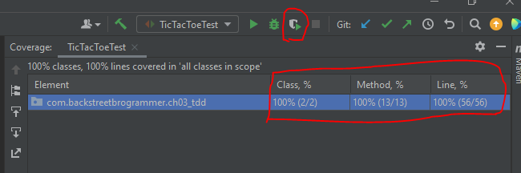

# Test Driven Development (TDD)

> This is a tutorials course covering Test-Driven-Development (TDD) in Java.

Tools used:

- JDK 11
- Maven
- JUnit 5, Mockito
- IntelliJ IDE

## Table of contents

1. [Introduction to Test-Driven-Development (TDD)](https://github.com/backstreetbrogrammer/37_TestDrivenDevelopment#chapter-01-introduction-to-test-driven-development-tdd)
    - [Testing Terminology](https://github.com/backstreetbrogrammer/37_TestDrivenDevelopment#testing-terminology)
    - [JUnit Test Example](https://github.com/backstreetbrogrammer/37_TestDrivenDevelopment#junit-test-example)
    - [Common Java Testing Frameworks](https://github.com/backstreetbrogrammer/37_TestDrivenDevelopment#common-java-testing-frameworks)
    - [Continuous Integration and Continuous Delivery (CI/CD)](https://github.com/backstreetbrogrammer/37_TestDrivenDevelopment#continuous-integration-and-continuous-delivery-cicd)
2. [JUnit in details](https://github.com/backstreetbrogrammer/37_TestDrivenDevelopment#chapter-02-junit-in-details)
    - [JUnit 5 Modules](https://github.com/backstreetbrogrammer/37_TestDrivenDevelopment#junit-5-modules)
    - [JUnit Annotations](https://github.com/backstreetbrogrammer/37_TestDrivenDevelopment#junit-annotations)
    - [JUnit Maven Setup](https://github.com/backstreetbrogrammer/37_TestDrivenDevelopment#junit-maven-setup)
    - [JUnit Assertions](https://github.com/backstreetbrogrammer/37_TestDrivenDevelopment#junit-assertions)
    - [Parameterized Tests](https://github.com/backstreetbrogrammer/37_TestDrivenDevelopment#parameterized-tests)
3. [Mockito in details](https://github.com/backstreetbrogrammer/37_TestDrivenDevelopment#chapter-03-mockito-in-details)
    - [Mockito Annotations](https://github.com/backstreetbrogrammer/37_TestDrivenDevelopment#mockito-annotations)
4. [Interview Problem (UBS): Design Tic-Tac-Toe game using TDD](https://github.com/backstreetbrogrammer/37_TestDrivenDevelopment#chapter-02-junit-in-details)

---

## Chapter 01. Introduction to Test-Driven-Development (TDD)

**Test-driven-development (TDD)** is a software development process relying on software requirements being converted to
test cases **before** software is fully developed, and tracking all software development by repeatedly testing the
software against all test cases.

This is as opposed to software being developed first and test cases created later.

Test-driven development cycle:

1. **Add a test**
   > The adding of a new feature begins by writing a test that passes if and only if the feature's specifications are
   > met. The developer can discover these specifications by asking about use cases and user stories.
   > A key benefit of test-driven development is that it makes the developer focus on requirements before writing code.
   > This is in contrast with the usual practice, where unit tests are only written after code.
2. **Run all tests. The new test should fail for expected reasons**
   > This shows that new code is actually needed for the desired feature.
   > It validates that the test harness is working correctly.
   > It rules out the possibility that the new test is flawed and will always pass.
3. **Write the simplest code that passes the new test**
   > Inelegant or hard code is acceptable, as long as it passes the test. The code will be honed anyway in **Step 5**.
   > No code should be added beyond the tested functionality.
4. **All tests should now pass**
   > If any fail, the new code must be revised until they pass. This ensures the new code meets the test
   > requirements and does not break existing features.
5. **Refactor as needed, using tests after each refactor to ensure that functionality is preserved**
   > Code is refactored for readability and maintainability. In particular, hard-coded test data should be removed.
   > Running the test suite after each refactor helps ensure that no existing functionality is broken.
    - Examples of refactoring:
        - moving code to where it most logically belongs
        - removing duplicate code
        - making **names** self-documenting
        - splitting methods into smaller pieces
        - re-arranging inheritance hierarchies

**Repeat**

The cycle above is repeated for each new piece of functionality.

Tests should be small and incremental, and commits made often.

That way, if new code fails some tests, the programmer can simply undo or revert rather than debug excessively.

### Testing Terminology

**Code Under Test**

This is the code (or application) we are testing.

**Test Fixture**

A test fixture is a fixed state of a set of objects used as a baseline for running tests. The purpose of a test fixture
is to ensure that there is a well known and fixed environment in which tests are run so that results are **repeatable**.

Includes: input data, mock objects, loading database with known data, etc.

**Unit Tests / Unit Testing**

- Code written to test code under test
- Designed to test specific sections of code
- Percentage of lines of code tested is **code-coverage**
- Ideal coverage is in the **70-80%** range
- Should be **unity** and execute very fast
- Should have no external dependencies, i.e. no database, no Spring context, etc.

**Integration Tests**

- Designed to test behaviors between objects and parts of the overall system
- Much larger scope
- Can include the Spring Context, database, and message brokers
- Will run much slower than unit tests

**Functional Tests**

- Typically, means we are testing the running application
- Application is live, likely deployed in a known environment
- Functional touch points are tested - (i.e. Using a web driver, calling web services, sending / receiving messages,
  etc.)


All three types of tests play important roles for software quality.

The majority of tests should be **Unit Tests**

- Small, fast, lightweight tests
- Very detailed and specific

**Integration Tests** should be next largest category.

**Functional Tests** are smallest and least detailed of the categories.

**TDD**

- Test Driven Development
- Write tests first, code to **fix** tests, refactor code to clean-up, improve etc.

**BDD**

- Behavior Driven Development
- Very similar to TDD
- Describes the expected behavior of software
- Often expressed as: **when / then** OR **given / when / then**

**Which is better to use?**

- Use both!!

**Mocks**

- A fake implementation of a class used for testing
- A test double for dependent objects - like a datasource
- Can provide expected responses
- Can verify expected interactions

**Spy**

- Like a mock, but real object is used
- Mocks completely replace expected object
- Spys are wrappers, but with real object inside

### JUnit Test Example

Suppose we create our class `Guidemy` which has got one method:

```java
public class Guidemy {

    public String getCourse() {
        return "";
    }

}
```

Now, before writing any implementation of the method, we first start with **JUnit test class**:

```java
import org.junit.jupiter.api.Test;

import static org.junit.jupiter.api.Assertions.assertEquals;

public class GuidemyTest {

    @Test
    void testGetCourseMethod() {
        final Guidemy guidemy = new Guidemy();
        assertEquals("Advanced Java", guidemy.getCourse());
    }
}
```

When we run this test case, it will fail as we expect the course name to be returned as `Advanced Java`.

Now we **fix** the code:

```java
public class Guidemy {

    public String getCourse() {
        return "Advanced Java";
    }

}
```

This will pass the test now, and we are good to write some more test cases **first** and implement the main source code
accordingly.

After the test is passed, we will keep on **refactoring** the code and rerun the tests whenever the code is changed.

As it's a maven project -> we have the defined project structure.


### Common Java Testing Frameworks

**JUnit**

- The most popular testing framework for Java
- **JUnit 5** was released in September 2017
- **JUnit 5** will be the primary focus in this course

**TestNG**

- Created by Cédric Beust in 2004 as an alternative to JUnit
- Cédric wished to address deficiencies in **JUnit**
- Functionality of **TestNG** and **JUnit** have evolved to be very close
- It is still popular, but much smaller base

**Spock**

- Testing Framework in **Groovy** for testing Java
- Does require knowledge of Groovy
- Follows BDD approach
- Includes own Mocking framework
- Very popular where Groovy is used

**Cucumber**

- BDD Testing Framework
- Available for Java, Javascript, and Ruby
- Very popular in Ruby community
- Gaining popularity in Java community
- Uses Gherkin syntax
- Natural English like syntax
- Describe the what, not the how

**Mockito**

- Mocking framework for testing
- Only does mocks
- Need to use with testing framework such as JUnit or TestNG
- Top 10 Java Library
- Very popular for testing Spring applications
- Will be covered in this course

**Spring MVC Test**

- Testing module found in the Spring Framework
- Very versatile for testing Spring MVC Controllers
- Provides mock Servlet environment
- Used in conjunction with a testing framework such as JUnit, TestNG, or Spock

**REST Assured**

- Java framework for testing RESTful web services
- Provides very powerful DSL for testing Restful interfaces
- Can be used with Spring Mock MVC
- Tests follow a BDD Syntax

**Selenium**

- Web Browser Automation
- Allows us to write functional tests against web applications
- Only Web Browser Automation
- Need to use a Testing Framework such as JUnit, TestNG, or Spock

**GEB**

- Groovy Browser Automation
- Uses Selenium under the covers
- Has JQuery-ish page element selectors
- Needs to be used with a Test Framework
- Very popular to use with Spock

**Test Containers**

- Allows us to launch Docker containers from JUnit Tests
- Allows us to start databases, message brokers, etc. for integration and functional tests
- Can be combined with Selenium for testing web applications

### Continuous Integration and Continuous Delivery (CI/CD)

**Continuous Integration (CI)** is a development practice that requires developers to integrate code into a shared
repository several times a day. Each check-in is then verified by an automated build, allowing teams to detect problems
early.

Continuous Integration does not get rid of bugs, but it does make them dramatically easier to find and remove.

**CI Practices**

- Maintain a single source repository
- Automate build
- Make our build self-testing
- Every commit should build on integration machine
- Fix broken builds immediately
- Keep the build fast
- Test in a clone of the production environment
- Make it easy for anyone to get the latest executable version
- Everyone can see what is happening

**Common CI Build Servers**

**1. Self-Hosted**

Jenkins, Bamboo, TeamCity, Hudson

**Fun-Fact** - Jenkins forked from Hudson in 2010 due to a legal conflict with Oracle.

**2. Cloud-Based**

CircleCI, TravisCI, Codeship, GitLab CI, AWS CodeBuild, and many more.

**Continuous Deployment** will automatically deploy build artifacts after all CI tests have run.

**Continuous Deployment Practices**

- Should happen with every commit
- Completely automated
- May include a staging area from which additional automated tests are run
- Easily confused with **Continuous Delivery**
- Example: AWS CodePipeline

**Continuous Delivery (CD)** is the process to automatically deliver code changes directly to the Production
Environment.

**Continuous Delivery (CD) Practices**

- Involves a high degree of automation in Testing and Deployment
- Must have a **VERY** mature process
- Can be difficult in some industries due to Regulatory requirements
- This area is evolving
- Few Hard "Rules" - No Standard Way
- "Best Practices" are maturing, and still a lot of lively debate!

---

## Chapter 02. JUnit in details

### JUnit 5 Modules

**JUnit Platform** - The foundation for launching testing frameworks on the JVM. Allow tests to be run from a Console
Launcher, or build tools such as Maven and Gradle.

**JUnit Jupiter** - Programming model for writing tests and extensions to JUnit.

**JUnit Vintage** - Provides a test engine for running JUnit 3 and JUnit 4 tests.

### JUnit Annotations

| Annotation         | Description                                                 | 
|--------------------|-------------------------------------------------------------|
| @Test              | Marks a method as a test method                             | 
| @ParameterizedTest | Marks method as a parameterized test                        | 
| @RepeatedTest      | Repeat test N times                                         | 
| @TestFactory       | Test Factory method for dynamic tests                       | 
| @TestInstance      | Used to configure test instance lifecycle                   | 
| @TestTemplate      | Creates a template to be used by multiple test cases        | 
| @DisplayName       | Human friendly name for test                                | 
| @BeforeEach        | Method to run before each test case                         | 
| @AfterEach         | Method to run after each test case                          | 
| @BeforeAll         | Static method to run before all test cases in current class | 
| @AfterAll          | Static method to run after all test cases in current class  | 
| @Nested            | Creates a nested test class                                 | 
| @Tag               | Declare 'tags' for filtering tests                          | 
| @Disabled          | Disable test or test class                                  |
| @ExtendWith        | Used to register extensions                                 |

### JUnit Maven Setup

In `pom.xml`, need to add following **dependencies** for `JUnit`:

- junit-jupiter-api
- junit-jupiter-engine
- junit-jupiter-params

For `Mockito`:

- mockito-core
- mockito-junit-jupiter

Then, need to add build **plugins**:

- maven-compiler-plugin
- maven-surefire-plugin
- maven-failsafe-plugin

Once the dependencies and plugins are added in `pom.xml`, run `mvn clean test` from terminal to confirm the build is
success.

**JUnit Test Lifecycle**


**Sample JUnit 5 test class**

```java
import org.junit.jupiter.api.*;

import static org.junit.jupiter.api.Assertions.assertEquals;
import static org.junit.jupiter.api.Assertions.assertNotNull;

public class GuidemyTest {

    Guidemy guidemy;

    @BeforeAll
    public static void beforeClass() {
        System.out.println("Before - I am called once!");
    }

    @BeforeEach
    void setUp() {
        System.out.println("In Before Each...");
        guidemy = new Guidemy();
    }

    @Test
    @DisplayName("Test that object is not null after setUp()")
    void testObjectNotNull() {
        assertNotNull(guidemy);
    }

    @Test
    @DisplayName("Test getting current course name")
    void testGetCourseMethod() {
        assertEquals("Advanced Java", guidemy.getCourse());
    }

    @AfterEach
    void tearDown() {
        System.out.println("In After Each...");
    }

    @AfterAll
    public static void afterClass() {
        System.out.println("After - I am called once!");
    }
}
```

**Output**

```
Before - I am called once!
In Before Each...
In After Each...
In Before Each...
In After Each...
After - I am called once!
```

The tests display name are shown as given in the `@DisplayName` with tests success and failure results:


### JUnit Assertions

**Assertion** - we are asserting a condition for the test to pass.

Examples:

```
assertEquals(5, 5);
assertNotEquals(2, 5);

assertNotNull(object);
assertNull(object);

assertTrue(bool);
assertFalse(bool);

// overloaded method for an optional failure message
assertEquals("Python", guidemy.getCourse(), "Course name is incorrect");  
assertEquals("Python", guidemy.getCourse(), () -> "Course name is incorrect"); // lambda  
```

JUnit incorporates support of **lambdas** in assertions:

- **Grouped assertions**: all assertions run in block, all failures reported
- **Dependent assertions**: allows for blocks of grouped assertions
- **Expected exceptions**: tested with `assertThrows()` lambda expression
- **Timeouts**: tested with `assertTimeout()` lambda expression

The whole API documentation can be found here:
[Assertions API](https://junit.org/junit5/docs/5.0.1/api/org/junit/jupiter/api/Assertions.html)

**Grouped assertions**

Suppose we have a class `Student`:

```java
public class Student {

    private final long id;
    private final String firstName;
    private final String lastName;

    public Student(final long id, final String firstName, final String lastName) {
        if (id <= 0) throw new IllegalArgumentException("ID can not be 0 or negative");
        this.id = id;
        this.firstName = firstName;
        this.lastName = lastName;
    }

    public long getId() {
        return id;
    }

    public String getFirstName() {
        return firstName;
    }

    public String getLastName() {
        return lastName;
    }
}
```

We can group all assertions run in block => all failures are reported.

```java
import org.junit.jupiter.api.Test;

import static org.junit.jupiter.api.Assertions.assertAll;
import static org.junit.jupiter.api.Assertions.assertEquals;

public class StudentTest {

    @Test
    void groupedAssertions() {
        // given
        final Student student = new Student(1L, "John", "Wright");

        // then
        assertAll("Test Students Set",
                  () -> assertEquals("John", student.getFirstName()),
                  () -> assertEquals("Wright", student.getLastName())
                 );
    }

    @Test
    void groupedAssertionsWithMessage() {
        // given
        final Student student = new Student(1L, "John", "Wright");

        // then
        assertAll("Test Students Set",
                  () -> assertEquals("John", student.getFirstName(), "First Name Failed"),
                  () -> assertEquals("Wright", student.getLastName(), "Last Name Failed")
                 );
    }

}
```

**Dependent assertions**

We have a class `TeachingAssistant` which extends class `Student`:

```java
public class TeachingAssistant extends Student {
    private final String courseToAssist;
    private final int age;

    public TeachingAssistant(final long id, final String firstName,
                             final String lastName, final String courseToAssist, final int age) {
        super(id, firstName, lastName);
        this.courseToAssist = courseToAssist;
        this.age = age;
    }

    public String getCourseToAssist() {
        return courseToAssist;
    }

    public int getAge() {
        return age;
    }
}
```

We can have blocks of grouped assertions:

```java
import org.junit.jupiter.api.Test;

import static org.junit.jupiter.api.Assertions.assertAll;
import static org.junit.jupiter.api.Assertions.assertEquals;

public class TeachingAssistantTest {

    @Test
    void dependentAssertions() {
        // given
        final TeachingAssistant teachingAssistant
                = new TeachingAssistant(2L, "Mary", "Lam", "Advanced Java", 21);

        // then
        assertAll("Students Test",
                  () -> assertAll("Student Properties",
                                  () -> assertEquals("Mary", teachingAssistant.getFirstName(),
                                                     "First Name did not match"),
                                  () -> assertEquals("Lam", teachingAssistant.getLastName())),
                  () -> assertAll("TeachingAssistant Properties",
                                  () -> assertEquals("Advanced Java", teachingAssistant.getCourseToAssist(),
                                                     "Course did not match"),
                                  () -> assertEquals(21, teachingAssistant.getAge()))
                 );
    }

}
```

**Expected exceptions**

We can use `assertThrows()` lambda expression for testing expected exceptions:

```
    @Test
    void testExpectedExceptions() {
        assertThrows(IllegalArgumentException.class,
                     () -> new Student(-1L, "Unknown", "Student"));
    }
```

**Timeouts**

We can use `assertTimeout()` lambda expression for testing the timeout operations:

```
    @Test
    void testTimeout() {
        assertTimeout(Duration.ofMillis(100), () -> {
            System.out.println("Running the timeout test");
            TimeUnit.MILLISECONDS.sleep(80L);
        });
    }

    @Test
    void testTimeoutPreemptively() {
        assertTimeoutPreemptively(Duration.ofMillis(100), () -> {
            System.out.println("Running the timeout test preemptively");
            TimeUnit.MILLISECONDS.sleep(80L);
        });
    }
```

**Disabling a test**

We can disable a unit test to run by using `@Disabled` annotation:

```
    @Disabled
    @Test
    @DisplayName("Test getting current course name")
    void testGetCourseMethod() {
        assertEquals("Advanced Java", guidemy.getCourse());
    }
```

We can also disable the whole test class and give a comment value why it is disabled:

```
@Disabled(value = "Disabled until we learn Mocking")
public class GuidemyTest { 
   ...
   ...
}
```

**Repeated Tests**

We can run a unit test multiple times using `@RepeatedTest` annotation.

_Example 1_

```
    @RepeatedTest(5)
    @DisplayName("Test getting current course name")
    void testGetCourseMethod() {
        assertEquals("Advanced Java", guidemy.getCourse());
    }
```


_Example 2_

```
    @RepeatedTest(value = 5, name = "{displayName} : {currentRepetition} - {totalRepetitions}")
    @DisplayName("Test getting current course name")
    void testGetCourseMethod() {
        assertEquals("Advanced Java", guidemy.getCourse());
    }
```


### Parameterized Tests

Using parameterized tests, we can test on various input values in the same unit test case.

**Value Source**

All parameters are from a constant **value**.

```
    @ParameterizedTest
    @ValueSource(strings = {"Advanced", "Java", "Course"})
    void testValueSource(final String val) {
        System.out.println(val);
    }
```


**Enum Source**

All parameters are from `Enum`.

```
    @DisplayName("Enum Source Test")
    @ParameterizedTest(name = "{displayName} - [{index}] {arguments}")
    @EnumSource(CourseType.class)
    void enumTest(final CourseType courseType) {
        System.out.println(courseType.name());
    }
```

**CSV Source**

All parameters are from constant **values**, but it can be of different **types**.

```
    @DisplayName("CSV Input Test")
    @ParameterizedTest(name = "{displayName} - [{index}] {arguments}")
    @CsvSource({
            "Java, 1, 4",
            "Python, 2, 8",
            "JavaScript, 5, 3"
    })
    void csvInputTest(final String courseName, final int val1, final int val2) {
        System.out.printf("%s = %d:%d%n", courseName, val1, val2);
    }
```

**CSV File Source**

All parameters are from a **csv** file.

```
    @DisplayName("CSV From File Test")
    @ParameterizedTest(name = "{displayName} - [{index}] {arguments}")
    @CsvFileSource(resources = "/input.csv", numLinesToSkip = 1)
    void csvFromFileTest(final String courseName, final int val1, final int val2) {
        System.out.printf("%s = %d:%d%n", courseName, val1, val2);
    }
```

**Method Provider**

All parameters are from a **static method**.

```
    @DisplayName("Method Provider Test")
    @ParameterizedTest(name = "{displayName} - [{index}] {arguments}")
    @MethodSource("getArgs")
    void fromMethodTest(final String courseName, final int val1, final int val2) {
        System.out.printf("%s = %d:%d%n", courseName, val1, val2);
    }

    static Stream<Arguments> getArgs() {
        return Stream.of(
                Arguments.of("Java", 9, 3),
                Arguments.of("Python", 2, 1),
                Arguments.of("JavaScript", 1, 7)
        );
    }
```

**Custom Provider**

All parameters are from separate **class** which implements `ArgumentsProvider`

```java
import org.junit.jupiter.api.extension.ExtensionContext;
import org.junit.jupiter.params.provider.Arguments;
import org.junit.jupiter.params.provider.ArgumentsProvider;

import java.util.stream.Stream;

public class CustomArgsProvider implements ArgumentsProvider {
    @Override
    public Stream<? extends Arguments> provideArguments(final ExtensionContext extensionContext) {
        return Stream.of(
                Arguments.of("Java", 9, 3),
                Arguments.of("Python", 2, 1),
                Arguments.of("JavaScript", 1, 7)
                        );
    }
}
```

_Test case_

```
    @DisplayName("Custom Provider Test")
    @ParameterizedTest(name = "{displayName} - [{index}] {arguments}")
    @ArgumentsSource(CustomArgsProvider.class)
    void fromCustomerProviderTest(final String courseName, final int val1, final int val2) {
        System.out.printf("%s = %d:%d%n", courseName, val1, val2);
    }
```

---

## Chapter 03. Mockito in details

Mockito is the most popular mocking framework for testing Java:

- **Mocks** (aka **Test Doubles**) are alternate implementations of objects to replace real objects in tests
- Works well with **Dependency Injection**
- For the class under test, injected dependencies can be **Mocks**

**_Types of Mocks_**

- **Dummy** - Object used just to get the code to compile
- **Fake** - An object that has an implementation, but not production ready
- **Stub** - An object with pre-defined answers to method calls
- **Mock** - An object with pre-defined answers to method calls, and has expectations of executions. Can throw an
  exception if an unexpected invocation is detected.
- **Spy** - In Mockito, Spies are Mock like wrappers around the **actual object**

**_Important Terminology_**

- **Verify** - Used to verify **number of times** a mocked method has been called
- **Argument Matcher** - Matches arguments passed to mocked method and will allow or disallow
- **Argument Captor** - Captures arguments passed to a mocked method and allows us to perform assertions of what was
  passed in to method

### Mockito Annotations

| Annotation   | Description                                 | 
|--------------|---------------------------------------------|
| @Mock        | Used to create a mock                       | 
| @Spy         | Used to create a spy                        | 
| @InjectMocks | Inject mocks / spys into a class under test | 
| @Captor      | Captures arguments to Mock                  | 

**Inline Mocks**

We can create mock for any class.

Calling any method on mock will return default value if method does not have `void` return type.

```
    @Test
    void testInlineMock() {
        final Map mapMock = mock(Map.class);
        assertEquals(0, mapMock.size());
    }
```

Preferred way to use Mocks is using annotations:

```java
import org.junit.jupiter.api.Test;
import org.junit.jupiter.api.extension.ExtendWith;
import org.mockito.Mock;
import org.mockito.junit.jupiter.MockitoExtension;

import java.util.Map;

@ExtendWith(MockitoExtension.class)
public class AnnotationMockTest {

    @Mock
    Map<String, Object> mapMock;

    @Test
    void testMock() {
        mapMock.put("Java", "Guidemy");
    }

}
```

**Inject Mocks**

We can use dependency injections as Mocks.

Suppose we have a `StudentsRepository` class:

```java
import java.util.HashMap;
import java.util.Map;

public class StudentsRepository {

    private final Map<Long, Student> cache = new HashMap<>();

    public Student save(final Student student) {
        return cache.put(student.getId(), student);
    }

    public Student findById(final Long id) {
        return cache.get(id);
    }

    public Student deleteById(final Long id) {
        return cache.remove(id);
    }

    public Student delete(final Student student) {
        return cache.remove(student.getId());
    }

}
```

Now this class is used as a dependency and injected as a constructor:

```java
public class GuidemyStudents {

    private final StudentsRepository repository;

    public GuidemyStudents(final StudentsRepository repository) {
        this.repository = repository;
    }

    public Student deleteById(final Long id) {
        return repository.deleteById(id);
    }

    public Student delete(final Student student) {
        return repository.delete(student);
    }

}
```

In our test class, we can inject `StudentsRepository` class as Mock:

```java
import com.backstreetbrogrammer.model.Student;
import org.junit.jupiter.api.Test;
import org.junit.jupiter.api.extension.ExtendWith;
import org.mockito.InjectMocks;
import org.mockito.Mock;
import org.mockito.junit.jupiter.MockitoExtension;

@ExtendWith(MockitoExtension.class)
public class GuidemyStudentsTest {

    @Mock
    StudentsRepository repository;

    @InjectMocks
    GuidemyStudents guidemyStudents;

    @Test
    void testDeleteById() {
        guidemyStudents.deleteById(1L);
    }

    @Test
    void testDelete() {
        guidemyStudents.delete(new Student(1L, "John", "Wright"));
    }

}
```

**Verify interactions with Mocks**

We can verify how many times a mock method has been invoked.

```
    @Test
    void testDeleteById() {
        // given - none

        // when
        guidemyStudents.deleteById(1L);
        guidemyStudents.deleteById(1L);

        // then
        verify(repository, times(2)).deleteById(1L);
        verify(repository, atLeastOnce()).deleteById(1L);
        verify(repository, atMost(5)).deleteById(1L);
        verify(repository, never()).deleteById(3L);
    }
```

**Returning values from Mocks**

Most important usage of using Mocks is to return a mocked value.

```
    @Test
    void testFindStudentById() {
        // given
        final Student student = new Student(1L, "John", "Wright");

        // when
        when(repository.findById(1L)).thenReturn(student);
        final Student studentFromRepo = repository.findById(1L);

        // then
        assertNotNull(studentFromRepo);
        assertTrue(student.equals(studentFromRepo));

        verify(repository, times(1)).findById(1L);
    }
```

**Argument Matchers**

We can use argument matchers `any()` to mock with any object or primitives we want.

```
    @Test
    void testDelete() {
        // given
        final Student student = new Student(1L, "John", "Wright");

        // when
        guidemyStudents.delete(student);

        // then
        verify(repository).delete(any(Student.class));
    }
```

**Argument Captors**

When the mock is calling a method with an argument, the argument can be captured and then tested. This is useful to
test if the argument passed to the testing method is changed as expected.

```
    @Test
    void testArgumentCaptor() {
        // given
        final Student student = new Student(1L, "John", "Wright");
        final ArgumentCaptor<Long> captor = ArgumentCaptor.forClass(Long.class);

        // when
        guidemyStudents.find(student);

        // then
        verify(repository).findById(captor.capture());
        assertEquals(1L, captor.getValue());
    }
```

---

## Chapter 04. Interview Problem (UBS): Design Tic-Tac-Toe game using TDD

Tic-tac-toe is a paper-and-pencil game for two players, **X** and **O**, who take turns marking the spaces in a **3×3**
grid. The player who succeeds in placing three respective marks in a horizontal, vertical, or diagonal row, wins the
game.

**Requirement 1**: A piece can be placed on any empty space of a 3×3 board.

We can split this requirement into **three** tests:

- When a piece is placed anywhere outside the X axis, then `RuntimeException` is thrown.
- When a piece is placed anywhere outside the Y axis, then `RuntimeException` is thrown.
- When a piece is placed on an occupied space, then `RuntimeException` is thrown.

**Solution 1**: Before we write any test, lets create our classes first.

In `source` package:

```java
public class TicTacToe {

}
```

In `test` package:

```java
import org.junit.jupiter.api.BeforeEach;

public class TicTacToeTest {

    private TicTacToe ticTacToe;

    @BeforeEach
    void setUp() {
        ticTacToe = new TicTacToe();
    }

}
```

Write **Test Case 1**: When a piece is placed anywhere outside the X axis, then `RuntimeException` is thrown.

```
    @Test
    @DisplayName("When a piece is placed outside the X axis, then RuntimeException is thrown")
    void whenXOutsideBoardThenThrowRuntimeException() {
        final Throwable exception = assertThrows(RuntimeException.class, () -> ticTacToe.play(6, 2));
        assertEquals(exception.getMessage(), "X is outside board");
    }
```

As `play()` method is not yet written in `TicTacToe` class, it will show compilation error. Thus, implement the
`play()` method in `TicTacToe` class:

```java
public class TicTacToe {

    public void play(final int x, final int y) {
        if (x < 1 || x > 3) {
            throw new RuntimeException("X is outside board");
        }
    }

}
```

Now RUN the test case and it should PASS.

Similarly, Write **Test Case 2**: When a piece is placed anywhere outside the Y axis, then `RuntimeException` is thrown.

```
    @Test
    @DisplayName("When a piece is placed outside the Y axis, then RuntimeException is thrown")
    void whenYOutsideBoardThenThrowRuntimeException() {
        final Throwable exception = assertThrows(RuntimeException.class, () -> ticTacToe.play(2, 5));
        assertEquals(exception.getMessage(), "Y is outside board");
    }
```

RUN the test and it should FAIL.

Implement the `play()` method to pass the test.

```java
public class TicTacToe {

    public void play(final int x, final int y) {
        if (x < 1 || x > 3) {
            throw new RuntimeException("X is outside board");
        } else if (y < 1 || y > 3) {
            throw new RuntimeException("Y is outside board");
        }
    }

}
```

RUN the test case and it should PASS.

Write **Test Case 3**: When a piece is placed on an occupied space, then `RuntimeException` is thrown.

```
    @Test
    @DisplayName("When a piece is placed on an occupied space, then RuntimeException is thrown")
    void whenBoxOccupiedThenThrowRuntimeException() {
        ticTacToe.play(1, 2);
        final Throwable exception = assertThrows(RuntimeException.class, () -> ticTacToe.play(1, 2));
        assertEquals(exception.getMessage(), "Box is already occupied");
    }
```

RUN the test and it should FAIL.

Implement the `play()` method to pass the test.

```java
public class TicTacToe {

    private static final String EMPTY = "-1";

    private final String[][] board = new String[][]{
            {EMPTY, EMPTY, EMPTY},
            {EMPTY, EMPTY, EMPTY},
            {EMPTY, EMPTY, EMPTY}
    };

    public void play(final int x, final int y) {
        if (x < 1 || x > 3) {
            throw new RuntimeException("X is outside board");
        } else if (y < 1 || y > 3) {
            throw new RuntimeException("Y is outside board");
        }
        if (EMPTY.equals(board[x - 1][y - 1])) {
            board[x - 1][y - 1] = "X";
        } else {
            throw new RuntimeException("Box is already occupied");
        }
    }

}
```

RUN the test case and it should PASS.

RUN all the test cases and all should PASS - the new test case implementations should not break the previous test cases.

Now we have passed all the test cases - we should **REFACTOR** the code.

- remove the duplicate code
- segregate logic into methods to make it clean and more readable

```java
public class TicTacToe {

    private static final String EMPTY = "-1";

    private final String[][] board = new String[][]{
            {EMPTY, EMPTY, EMPTY},
            {EMPTY, EMPTY, EMPTY},
            {EMPTY, EMPTY, EMPTY}
    };

    public void play(final int x, final int y) {
        checkAxis(x, "X");
        checkAxis(y, "Y");
        setBox(x, y);
    }

    private void checkAxis(final int axis, final String axisName) {
        if (axis < 1 || axis > 3) {
            throw new RuntimeException(String.format("%s is outside board", axisName));
        }
    }

    private void setBox(final int x, final int y) {
        if (EMPTY.equals(board[x - 1][y - 1])) {
            board[x - 1][y - 1] = "X";
        } else {
            throw new RuntimeException("Box is already occupied");
        }
    }

}
```

We have completed **Requirement 1**.

---

**Requirement 2**: There should be a way to find out which player should play next.

We can split this requirement into **three** tests:

- The first turn should be played by played `X`.
- If the last turn was played by `X`, then the next turn should be played by `O`.
- If the last turn was played by `O`, then the next turn should be played by `X`.

**Solution 2**:

Write **Test Case 1**: The first turn should be played by played `X`.

```
    @Test
    @DisplayName("The first turn should be played by player X")
    void firstTurnShouldBePlayerX() {
        assertEquals("X", ticTacToe.nextPlayer());
    }
```

As `nextPlayer()` method is not yet written in `TicTacToe` class, it will show compilation error. Thus, implement the
`nextPlayer()` method in `TicTacToe` class:

```
    public String nextPlayer() {
        return "X";
    }
```

RUN the test case and it should PASS.

Now, we should make sure that players are changing. After `X` is finished, it should be `O`'s turn, then again `X`, and
so on.

Write both the test cases as it will require the same implementation:

- If the last turn was played by `X`, then the next turn should be played by `O`.
- If the last turn was played by `O`, then the next turn should be played by `X`.

```
    @Test
    @DisplayName("If the last turn was played by X, then the next turn should be played by O")
    void ifLastPlayerXThenNextPlayerIsO() {
        ticTacToe.play(1, 2); // this will be X
        assertEquals("O", ticTacToe.nextPlayer());
    }

    @Test
    @DisplayName("If the last turn was played by O, then the next turn should be played by X")
    void ifLastPlayerOThenNextPlayerIsX() {
        ticTacToe.play(1, 2); // this will be X
        ticTacToe.play(2, 1); // this will be O
        assertEquals("X", ticTacToe.nextPlayer());
    }
```

RUN the test case and it should FAIL.

Let's implement the code to pass it.

```
    private String lastPlayer = "";

    public void play(final int x, final int y) {
        checkAxis(x, "X");
        checkAxis(y, "Y");
        setBox(x, y);
        lastPlayer = nextPlayer();
    }

    public String nextPlayer() {
        if ("X".equals(lastPlayer)) {
            return "O";
        }
        return "X";
    }
```

RUN the test case and it should PASS.

Now we see that the 2 test cases are redundant and require same implementation. Thus, we can remove one of it.

Removed:

```
    @Test
    @DisplayName("If the last turn was played by X, then the next turn should be played by O")
    void ifLastPlayerXThenNextPlayerIsO() {
        ticTacToe.play(1, 2); // this will be X
        assertEquals("O", ticTacToe.nextPlayer());
    }
```

Now, can we REFACTOR the code? - YES. Let's use `enum` for players as it can be only `X` or `O` being played.

```
    enum Player {
        X("X"),
        O("O"),
        UNKNOWN("Unknown");

        private final String player;

        Player(final String player) {
            this.player = player;
        }

        public static Player fromPlayer(final String player) {
            return Arrays.stream(values())
                         .filter(pl -> pl.player.equals(player))
                         .findFirst()
                         .orElse(UNKNOWN);
        }

        @Override
        public String toString() {
            return player;
        }
    }

    private Player lastPlayer = Player.UNKNOWN;
    
    public void play(final int x, final int y) {
        checkAxis(x, "X");
        checkAxis(y, "Y");
        setBox(x, y);
        lastPlayer = Player.fromPlayer(nextPlayer());
    }

    public String nextPlayer() {
        if (lastPlayer == Player.X) {
            return Player.O.player;
        }
        return Player.X.player;
    }
```

RUN all the test cases and all should PASS.

We have completed **Requirement 2**.

---

**Requirement 3**: A player wins by being the first to connect a line of friendly pieces from one side or corner of the
board to the other.

We should verify horizontal, vertical, and diagonal lines.

- Test Case 1: If no winning condition is fulfilled, then there is no winner.

```
    @Test
    @DisplayName("If no winning condition is fulfilled, then there is no winner")
    public void ifNoWinningConditionThenNoWinner()
    {
        final String actual = ticTacToe.play(1,2);
        assertEquals("No winner", actual);
    }
```

As `play()` method is not returning `String` in `TicTacToe` class, it will show compilation error.

Let's change the method to return `String`.

```
    public String play(final int x, final int y) {
        checkAxis(x, "X");
        checkAxis(y, "Y");
        setBox(x, y);
        lastPlayer = Player.fromPlayer(nextPlayer());
        return "No winner";
    }
```

RUN the test case and it should PASS.

- Test Case 2: The player wins when the whole horizontal line is occupied by her pieces

```
    @Test
    @DisplayName("The player wins when the whole horizontal line is occupied by her pieces")
    public void whenWholeHorizontalLineIsOccupiedByXThenXIsWinner() {
        ticTacToe.play(1, 1); // X
        ticTacToe.play(1, 2); // O
        ticTacToe.play(2, 1); // X
        ticTacToe.play(2, 2); // O
        String actual = ticTacToe.play(3, 1); // X
        assertEquals("X is the winner", actual);
    }
```

We need to introduce not only which board boxes are empty, but also which player played them.

```
    public String play(final int x, final int y) {
        checkAxis(x, "X");
        checkAxis(y, "Y");
        setBox(x, y);
        lastPlayer = Player.fromPlayer(nextPlayer());
        for (int index = 0; index < 3; index++) {
            if (board[0][index].equals(lastPlayer.player) &&
                    board[1][index].equals(lastPlayer.player) &&
                    board[2][index].equals(lastPlayer.player)) {
                return String.format("%s is the winner", lastPlayer);
            }
        }
        return "No winner";
    }
```

RUN the test case and it should PASS.

REFACTOR the code.

```
    public String play(final int x, final int y) {
        checkAxis(x, "X");
        checkAxis(y, "Y");
        lastPlayer = Player.fromPlayer(nextPlayer());
        setBox(x, y, lastPlayer);
        return hasWin() ? String.format("%s is the winner", lastPlayer) : "No winner";
    }

    private boolean hasWin() {
        for (int index = 0; index < 3; index++) {
            if (board[0][index].equals(lastPlayer.player) &&
                    board[1][index].equals(lastPlayer.player) &&
                    board[2][index].equals(lastPlayer.player)) {
                return true;
            }
        }
        return false;
    }

    private void setBox(final int x, final int y, final Player lastPlayer) {
        if (EMPTY.equals(board[x - 1][y - 1])) {
            board[x - 1][y - 1] = lastPlayer.player;
        } else {
            throw new RuntimeException("Box is already occupied");
        }
    }
```

- Test Case 3: The player wins when the whole vertical line is occupied by her pieces

This is quite similar to the previous test case for horizontal line.

```
    @Test
    @DisplayName("The player wins when the whole vertical line is occupied by her pieces")
    public void whenWholeVerticalLineIsOccupiedByXThenXIsWinner() {
        ticTacToe.play(1, 1); // X
        ticTacToe.play(2, 1); // O
        ticTacToe.play(1, 2); // X
        ticTacToe.play(2, 2); // O
        String actual = ticTacToe.play(1, 3); // X
        assertEquals("X is the winner", actual);
    }
```

We need to change the index to check for vertical.

```
    private boolean hasWin() {
        boolean hasWin = false;
        for (int index = 0; index < 3; index++) {
            // horizontal
            if (board[0][index].equals(lastPlayer.player) &&
                    board[1][index].equals(lastPlayer.player) &&
                    board[2][index].equals(lastPlayer.player)) {
                hasWin = true;
                break;
            } else if (board[index][0].equals(lastPlayer.player) &&
                    board[index][1].equals(lastPlayer.player) &&
                    board[index][2].equals(lastPlayer.player)) { // vertical
                hasWin = true;
                break;
            }
        }
        return hasWin;
    }
```

RUN the test case and it should PASS.

- Test Case 4: The player wins when the whole diagonal line from the top-left to bottom-right is occupied by her pieces

```
    @Test
    @DisplayName("The player wins when the whole diagonal line from the top-left to bottom-right is occupied by her pieces")
    public void whenWholeDiagonalLineFromTopLeftToBottomRightIsOccupiedByXThenXIsWinner() {
        ticTacToe.play(1, 3); // X
        ticTacToe.play(1, 2); // O
        ticTacToe.play(2, 2); // X
        ticTacToe.play(2, 3); // O
        final String actual = ticTacToe.play(3, 1); // X
        assertEquals("X is the winner", actual);
    }
```

RUN the test case and it should FAIL.

We do not need to check in the loop and can simply have a check for top-left to bottom-right boxes.

```
    private boolean hasWin() {
        for (int index = 0; index < 3; index++) {
            // horizontal
            if (board[0][index].equals(lastPlayer.player) &&
                    board[1][index].equals(lastPlayer.player) &&
                    board[2][index].equals(lastPlayer.player)) {
                return true;
            } else if (board[index][0].equals(lastPlayer.player) &&
                    board[index][1].equals(lastPlayer.player) &&
                    board[index][2].equals(lastPlayer.player)) { // vertical
                return true;
            }
        }

        if (board[0][2].equals(lastPlayer.player) &&
                board[1][1].equals(lastPlayer.player) &&
                board[2][0].equals(lastPlayer.player)) { // diagonal - topLeft to rightBottom
            return true;
        }

        return false;
    }
```

RUN the test case and it should PASS.

- Test Case 5: The player wins when the whole diagonal line from the top-right to bottom-left is occupied by her pieces

```
    @Test
    @DisplayName("The player wins when the whole diagonal line from the top-right to bottom-left is occupied by her pieces")
    public void whenWholeDiagonalLineFromTopRightToBottomLeftIsOccupiedByXThenXIsWinner() {
        ticTacToe.play(3, 3); // X
        ticTacToe.play(1, 2); // O
        ticTacToe.play(2, 2); // X
        ticTacToe.play(1, 3); // O
        String actual = ticTacToe.play(1, 1); // X
        assertEquals("X is the winner", actual);
    }
```

RUN the test case and it should FAIL.

The implementation is very much similar to previous test case.

```
    private boolean hasWin() {
        for (int index = 0; index < 3; index++) {
            // horizontal
            if (board[0][index].equals(lastPlayer.player) &&
                    board[1][index].equals(lastPlayer.player) &&
                    board[2][index].equals(lastPlayer.player)) {
                return true;
            } else if (board[index][0].equals(lastPlayer.player) &&
                    board[index][1].equals(lastPlayer.player) &&
                    board[index][2].equals(lastPlayer.player)) { // vertical
                return true;
            }
        }

        if (board[0][2].equals(lastPlayer.player) &&
                board[1][1].equals(lastPlayer.player) &&
                board[2][0].equals(lastPlayer.player)) { // diagonal - topLeft to bottomRight
            return true;
        }

        if (board[2][2].equals(lastPlayer.player) &&
                board[1][1].equals(lastPlayer.player) &&
                board[0][0].equals(lastPlayer.player)) { // diagonal - topRight to bottomLeft
            return true;
        }

        return false;
    }
```

The `hasWin()` method is getting too verbose and a lot of return breaks - let's REFACTOR the code.

```
    private boolean hasWin() {
        return horizontalWinCheck() || verticalWinCheck() || diagonalWinCheck();
    }

    private boolean horizontalWinCheck() {
        for (int index = 0; index < 3; index++) {
            if (board[0][index].equals(lastPlayer.player) &&
                    board[1][index].equals(lastPlayer.player) &&
                    board[2][index].equals(lastPlayer.player)) {
                return true;
            }
        }
        return false;
    }

    private boolean verticalWinCheck() {
        for (int index = 0; index < 3; index++) {
            if (board[index][0].equals(lastPlayer.player) &&
                    board[index][1].equals(lastPlayer.player) &&
                    board[index][2].equals(lastPlayer.player))
                return true;
        }
        return false;
    }

    private boolean diagonalWinCheck() {
        return (board[0][2].equals(lastPlayer.player) &&
                board[1][1].equals(lastPlayer.player) &&
                board[2][0].equals(lastPlayer.player)) // topLeft to bottomRight
                || (board[2][2].equals(lastPlayer.player) &&
                board[1][1].equals(lastPlayer.player) &&
                board[0][0].equals(lastPlayer.player)); // topRight to bottomLeft
    }
```

RUN all the test cases and all should PASS.

We have completed **Requirement 3**.

---

**Requirement 4**: The result is a draw when all the boxes are filled and no winner.

Let's write the unit test.

```
    @Test
    @DisplayName("The result is a draw when all the boxes are filled and no winner")
    public void whenAllBoxesAreFilledAndNoWinnerThenDraw() {
        ticTacToe.play(1, 1); // X
        ticTacToe.play(1, 2); // O
        ticTacToe.play(1, 3); // X
        ticTacToe.play(2, 1); // O
        ticTacToe.play(2, 3); // X
        ticTacToe.play(2, 2); // O
        ticTacToe.play(3, 1); // X
        ticTacToe.play(3, 3); // O
        String actual = ticTacToe.play(3, 2); // X
        assertEquals("The result is draw", actual);
    }
```

RUN the test case and it should FAIL.

Implementation of the draw case is simple - we just need to check if all the boxes are occupied or not and there are no
more moves left.

```
    public String play(final int x, final int y) {
        checkAxis(x, "X");
        checkAxis(y, "Y");
        lastPlayer = Player.fromPlayer(nextPlayer());
        setBox(x, y, lastPlayer);
        String result;
        if (hasWin()) {
            result = String.format("%s is the winner", lastPlayer);
        } else if (isDraw()) {
            result = "The result is draw";
        } else {
            result = "No winner";
        }
        return result;
    }

    private boolean isDraw() {
        for (int x = 0; x < 3; x++) {
            for (int y = 0; y < 3; y++) {
                if (EMPTY.equals(board[x][y])) {
                    return false;
                }
            }
        }
        return true;
    }
```

RUN the test case and it should PASS.

RUN all the test cases and all should PASS.

We have done enough REFACTORING of the code but still we can further refactor it - based on the programming style of a
developer. We just need to ensure that whenever code is changed, all the test cases should PASS.

All the implementations are done, and now we need to ensure at-least 60% test code coverage is there. It means that we
have written enough unit test cases to cover testing for at-least 60% of code - this is a production standard maintained
in most of the firms.



We can run the test code coverage by clicking the button and it will give the results. As seen, in our Tic-Tac-Toe TDD
example, we have 100% tests code coverage.

Final `TicTacToe` class:

```java
import java.util.Arrays;

public class TicTacToe {

    private static final String EMPTY = "-1";

    enum Player {
        X("X"),
        O("O"),
        UNKNOWN("Unknown");

        private final String player;

        Player(final String player) {
            this.player = player;
        }

        public static Player fromPlayer(final String player) {
            return Arrays.stream(values())
                         .filter(pl -> pl.player.equals(player))
                         .findFirst()
                         .orElse(UNKNOWN);
        }

        @Override
        public String toString() {
            return player;
        }
    }

    private Player lastPlayer = Player.UNKNOWN;

    private final String[][] board = new String[][]{
            {EMPTY, EMPTY, EMPTY},
            {EMPTY, EMPTY, EMPTY},
            {EMPTY, EMPTY, EMPTY}
    };

    public String play(final int x, final int y) {
        checkAxis(x, "X");
        checkAxis(y, "Y");
        lastPlayer = Player.fromPlayer(nextPlayer());
        setBox(x, y, lastPlayer);
        final String result;
        if (hasWin()) {
            result = String.format("%s is the winner", lastPlayer);
        } else if (isDraw()) {
            result = "The result is draw";
        } else {
            result = "No winner";
        }
        return result;
    }

    private boolean isDraw() {
        for (int x = 0; x < 3; x++) {
            for (int y = 0; y < 3; y++) {
                if (EMPTY.equals(board[x][y])) {
                    return false;
                }
            }
        }
        return true;
    }

    private boolean hasWin() {
        return horizontalWinCheck() || verticalWinCheck() || diagonalWinCheck();
    }

    private boolean horizontalWinCheck() {
        for (int index = 0; index < 3; index++) {
            if (board[0][index].equals(lastPlayer.player) &&
                    board[1][index].equals(lastPlayer.player) &&
                    board[2][index].equals(lastPlayer.player)) {
                return true;
            }
        }
        return false;
    }

    private boolean verticalWinCheck() {
        for (int index = 0; index < 3; index++) {
            if (board[index][0].equals(lastPlayer.player) &&
                    board[index][1].equals(lastPlayer.player) &&
                    board[index][2].equals(lastPlayer.player))
                return true;
        }
        return false;
    }

    private boolean diagonalWinCheck() {
        return (board[0][2].equals(lastPlayer.player) &&
                board[1][1].equals(lastPlayer.player) &&
                board[2][0].equals(lastPlayer.player)) // topLeft to bottomRight
                || (board[2][2].equals(lastPlayer.player) &&
                board[1][1].equals(lastPlayer.player) &&
                board[0][0].equals(lastPlayer.player)); // topRight to bottomLeft
    }

    private void checkAxis(final int axis, final String axisName) {
        if (axis < 1 || axis > 3) {
            throw new RuntimeException(String.format("%s is outside board", axisName));
        }
    }

    private void setBox(final int x, final int y, final Player lastPlayer) {
        if (EMPTY.equals(board[x - 1][y - 1])) {
            board[x - 1][y - 1] = lastPlayer.player;
        } else {
            throw new RuntimeException("Box is already occupied");
        }
    }

    public String nextPlayer() {
        if (lastPlayer == Player.X) {
            return Player.O.player;
        }
        return Player.X.player;
    }

}
```

Final `TicTacToeTest` class:

```java
import org.junit.jupiter.api.BeforeEach;
import org.junit.jupiter.api.DisplayName;
import org.junit.jupiter.api.Test;

import static org.junit.jupiter.api.Assertions.assertEquals;
import static org.junit.jupiter.api.Assertions.assertThrows;

public class TicTacToeTest {

    private TicTacToe ticTacToe;

    @BeforeEach
    void setUp() {
        ticTacToe = new TicTacToe();
    }

    @Test
    @DisplayName("When a piece is placed outside the X axis, then RuntimeException is thrown")
    void whenXOutsideBoardThenThrowRuntimeException() {
        final Throwable exception = assertThrows(RuntimeException.class, () -> ticTacToe.play(6, 2));
        assertEquals(exception.getMessage(), "X is outside board");
    }

    @Test
    @DisplayName("When a piece is placed outside the Y axis, then RuntimeException is thrown")
    void whenYOutsideBoardThenThrowRuntimeException() {
        final Throwable exception = assertThrows(RuntimeException.class, () -> ticTacToe.play(2, 5));
        assertEquals(exception.getMessage(), "Y is outside board");
    }

    @Test
    @DisplayName("When a piece is placed on an occupied space, then RuntimeException is thrown")
    void whenBoxOccupiedThenThrowRuntimeException() {
        ticTacToe.play(1, 2);
        final Throwable exception = assertThrows(RuntimeException.class, () -> ticTacToe.play(1, 2));
        assertEquals(exception.getMessage(), "Box is already occupied");
    }

    @Test
    @DisplayName("The first turn should be played by player X")
    void firstTurnShouldBePlayerX() {
        assertEquals("X", ticTacToe.nextPlayer());
    }

    @Test
    @DisplayName("If the last turn was played by O, then the next turn should be played by X")
    void ifLastPlayerOThenNextPlayerIsX() {
        ticTacToe.play(1, 2); // this will be X
        ticTacToe.play(2, 1); // this will be O
        assertEquals("X", ticTacToe.nextPlayer());
    }

    @Test
    @DisplayName("If no winning condition is fulfilled, then there is no winner")
    public void ifNoWinningConditionThenNoWinner() {
        final String actual = ticTacToe.play(1, 2);
        assertEquals("No winner", actual);
    }

    @Test
    @DisplayName("The player wins when the whole horizontal line is occupied by her pieces")
    public void whenWholeHorizontalLineIsOccupiedByXThenXIsWinner() {
        ticTacToe.play(1, 1); // X
        ticTacToe.play(1, 2); // O
        ticTacToe.play(2, 1); // X
        ticTacToe.play(2, 2); // O
        final String actual = ticTacToe.play(3, 1); // X
        assertEquals("X is the winner", actual);
    }

    @Test
    @DisplayName("The player wins when the whole vertical line is occupied by her pieces")
    public void whenWholeVerticalLineIsOccupiedByXThenXIsWinner() {
        ticTacToe.play(1, 1); // X
        ticTacToe.play(2, 1); // O
        ticTacToe.play(1, 2); // X
        ticTacToe.play(2, 2); // O
        final String actual = ticTacToe.play(1, 3); // X
        assertEquals("X is the winner", actual);
    }

    @Test
    @DisplayName("The player wins when the whole diagonal line from the top-left to bottom-right is occupied by her pieces")
    public void whenWholeDiagonalLineFromTopLeftToBottomRightIsOccupiedByXThenXIsWinner() {
        ticTacToe.play(1, 3); // X
        ticTacToe.play(1, 2); // O
        ticTacToe.play(2, 2); // X
        ticTacToe.play(2, 3); // O
        final String actual = ticTacToe.play(3, 1); // X
        assertEquals("X is the winner", actual);
    }

    @Test
    @DisplayName("The player wins when the whole diagonal line from the top-right to bottom-left is occupied by her pieces")
    public void whenWholeDiagonalLineFromTopRightToBottomLeftIsOccupiedByXThenXIsWinner() {
        ticTacToe.play(3, 3); // X
        ticTacToe.play(1, 2); // O
        ticTacToe.play(2, 2); // X
        ticTacToe.play(1, 3); // O
        final String actual = ticTacToe.play(1, 1); // X
        assertEquals("X is the winner", actual);
    }

    @Test
    @DisplayName("The result is a draw when all the boxes are filled and no winner")
    public void whenAllBoxesAreFilledAndNoWinnerThenDraw() {
        ticTacToe.play(1, 1); // X
        ticTacToe.play(1, 2); // O
        ticTacToe.play(1, 3); // X
        ticTacToe.play(2, 1); // O
        ticTacToe.play(2, 3); // X
        ticTacToe.play(2, 2); // O
        ticTacToe.play(3, 1); // X
        ticTacToe.play(3, 3); // O
        final String actual = ticTacToe.play(3, 2); // X
        assertEquals("The result is draw", actual);
    }

}
```
